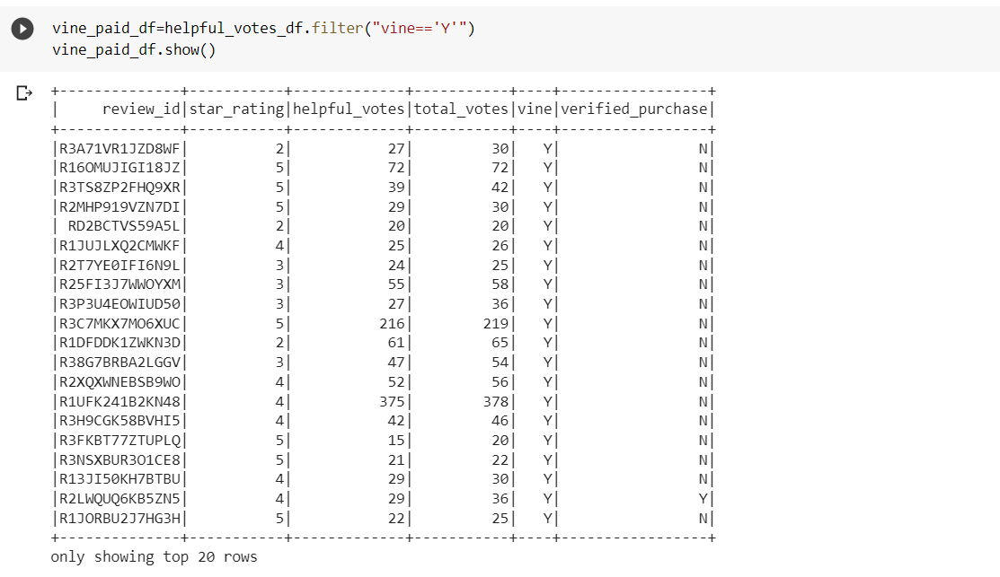
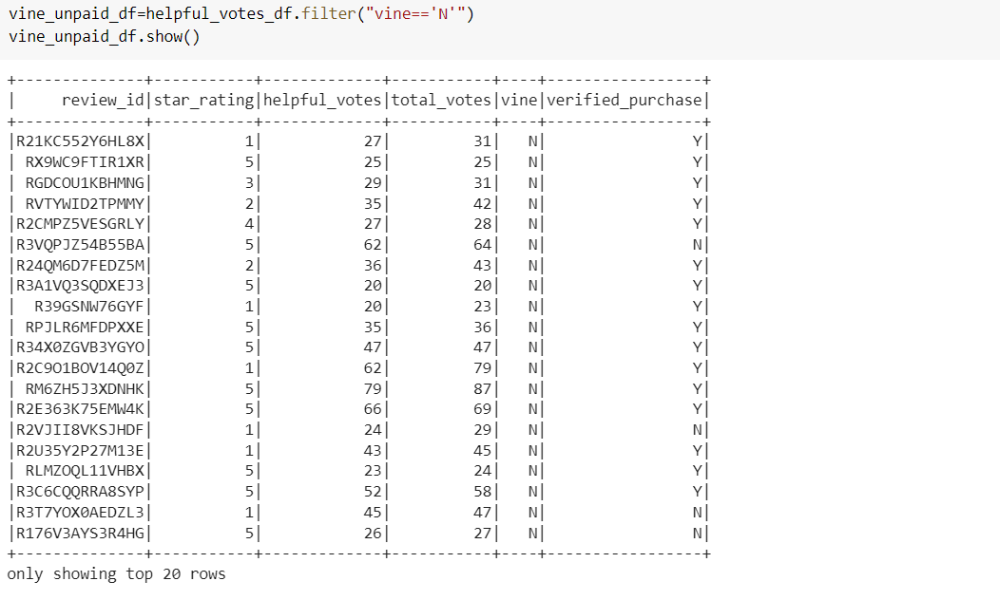
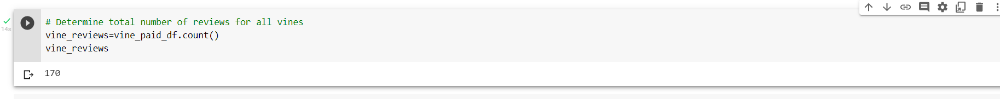
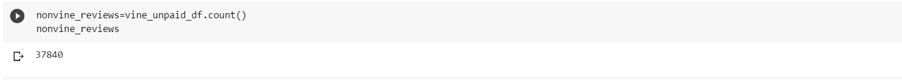
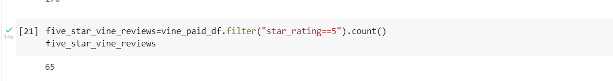
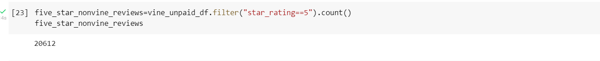
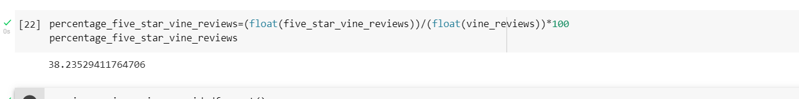
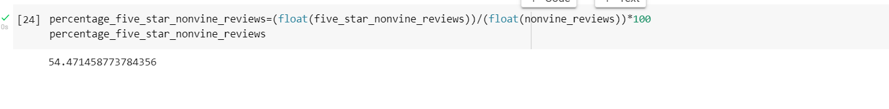

# Amazon_Vine_Analysis
Big Data Module 16 assignment

## Overview of the analysis
Amazon vine services is a program allow manufacturers and publishers to receive reviews for their products. Jennifer and her team is working on a project to analyze the Amazon reviews written by members of the paid Amazon vine program. Purpose of this analysis is to determine if there is an biasness in reviews from favourable vine members by comparing it to unapid vine members by creating a database, making connecting with AWS RDS instance, performing ETL in google colab and last but not the least creating tables in pg Admin. 
Dataset used in the project from Amazon reviews dataset is https://s3.amazonaws.com/amazon-reviews-pds/tsv/amazon_reviews_us_Pet_Products_v1_00.tsv.gz 

## Results of the analysis:

- How many Vine reviews and non-Vine reviews were there?
Using total helpful votes, created a dataframe i.e. vine_paid & vine_unpaid from which number of reviews are extracted.

There are 170 vine reviews and 37840 nonvine reviews are recorded.

- How many Vine reviews were 5 stars? How many non-Vine reviews were 5 stars?
There are 65 five star vine reviews and 20612 are non vine reviews of 5 stars.

- What percentage of Vine reviews were 5 stars? What percentage of non-Vine reviews were 5 stars?
There are 38.24% and 54.47% five star vine and non vine reviews respectively. 

## Summary
In conclusion, there are no such results showing that there is a biasness in reviews of paid vine program as percentage of 5 star vine reviews which is around 38% is less than 5 star reviews of non vine unpaid program customers which is 54.47%. There is no such positivety bias for reviews inj vine paid program. For additional analysis, we can use NPL pipeline to check positive, touchy and other words used by vine paid customers in 5 star reviews. 